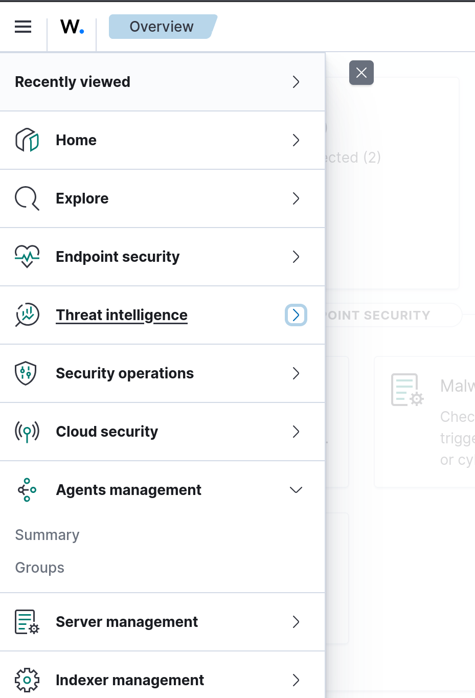

# Detailed Configuration for Kali Linux

| S.no | Contents |
| --- | --- |
| 1. | Setting up the Wazuh Agent |
| 2. | Attacking Mysql Service |
| 3. | Setting up Metasploit Campaigns |

## Setting up the Wazuh Agent
- After successful installation and initial update, head over to `https://UBUNTU_IP` to access the Wazuh Dashboard
- Open the left side bar, expand the *Agents management* view

- Go to Summary > Deploy New Agent
> Follow the on screen insturctions! they're sufficient alone to get this done
1. Select the package to download and install on your system
2. Server address
3. Optional settings
4. Run the following commands to download and install the agent
5. Start the agent

## Attacking Mysql service on Fedora
- Connect to fedora using the --skip_ssl
```shell-session
mysql -u root -H FEDORA_HOST --skil_ssl -p 
```

## Attacking FTP service on fedora
```shell-session
ftp FEDORA_IP 21
# Enter any Username
# Enter any password
```

> Now you can view alerts created inside Wazuh Threat Hunting Module