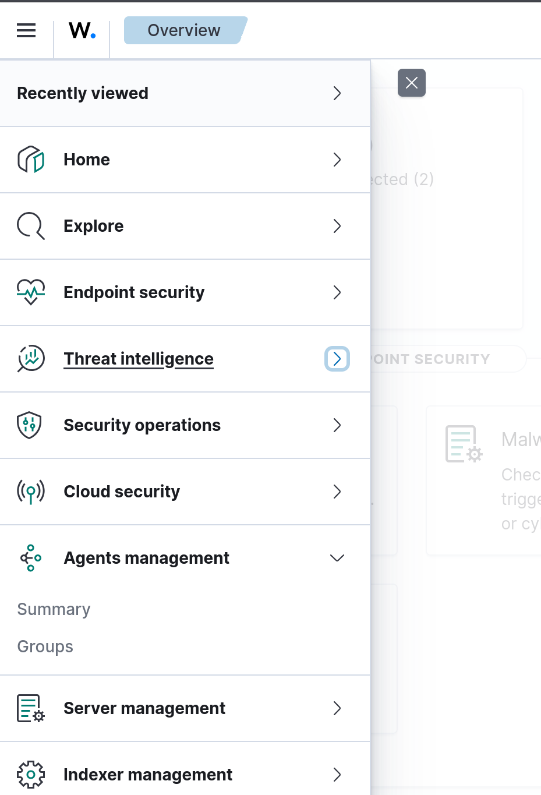

# Detailed Configuration for Fedora Server

| S.no | Contents |
| --- | --- |
| 1. | Setting up the Wazuh Agent |
| 2. | Installing OpenCanary Honeypot |
| 3. | Forwarding Honeypot Logs to Wazuh |

> To open a port in fedora, add a firewalld entry such as:
```shell-session
sudo firewall-cmd --permanent --add-port=PORT_NUMBER/PROTOCOL
```

## Setting up the Wazuh Agent
- After successful installation and initial update, head over to `https://UBUNTU_IP` to access the Wazuh Dashboard
- Open the left side bar, expand the *Agents management* view

- Go to Summary > Deploy New Agent
> Follow the on-screen insturctions! they're sufficient alone to get this done
1. Select the package to download and install on your system
2. Server address
3. Optional settings
4. Run the following commands to download and install the agent
5. Start the agent

## Installing OpenCanary Honeypot
- Install Python3 and create a virtual environment inside $HOME
```bash
sudo apt install python3 && cd ~
python -m venv .s
pip3 install opencanary
```
- It's recommended to add `~/.venv/bin/` to $PATH environment
```shell-session
nano .bashrc
```
- Run [start_honeypot.sh](./start_honeypot.sh) found in this directory
- Copy [opencanary.conf](./opencanary.conf) to `/etc/opencanaryd/opencanary.conf`
> Since opencanary saves all it's log files in `/var/tmp/opencanary.log`, we have to add this file inside Wazuh Agent's `ossec.conf`
- Copy [ossec.conf](./ossec.conf) over to `/var/ossec/etc/ossec.conf`