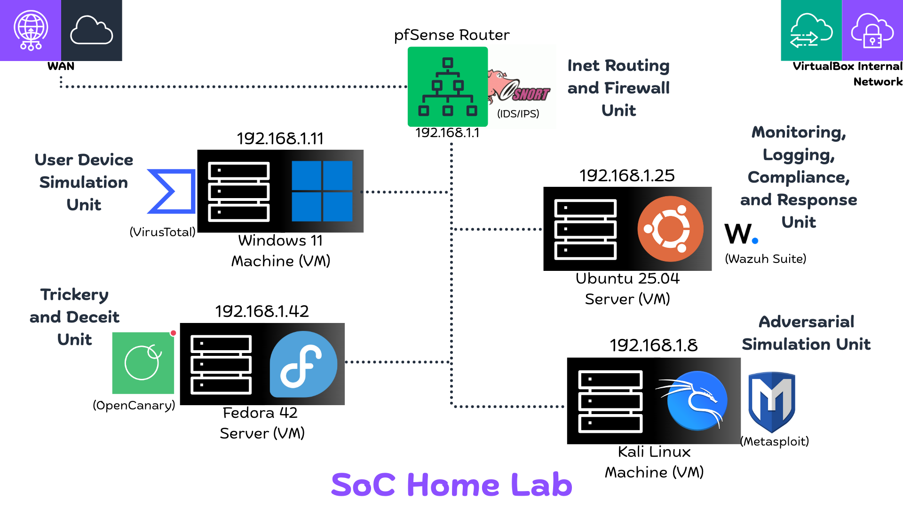
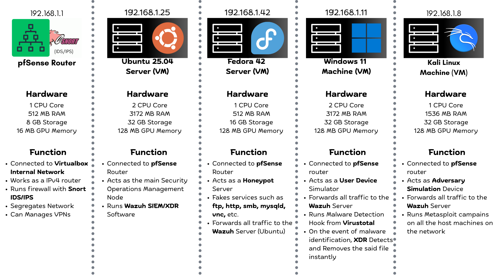

<div align="center">

# 🛡️ Security Operations Centre 🛡️
A home lab project :)




This repository documents the steps I took for building a personal, modern, free and open source Security Operations Centre (SoC) lab at home!

Whether you're a blue team rookie or a seasoned cyber geek, this lab will help you level up your home defense game

<br>

🌸 **Key Features**
</div>

- **Intelligent XDR**: Wazuh detects malware and **instantly** removes it
- **Next Generation Router**: pfSense is homelabbing done right :)
- **Web Security**: Wazuh detects any and all kinds of SQL attacks/ Arbitrary Input against web application
- **Robust Honeypot**: OpenCanary detects any interaction with the fake services and alerts Wazuh Server, which you can then hook into mail or discord
- **Red Team Campaigns**: Run automated scripts via Metasploit to perform Adversarial Campaigns

<div align=center>

*See these in action in the PoC Video!*


<br>

| Section | Contents             |
|------|------------------------|
| 1    | Problem Statement     |
| 2    | Techical Overview    |
| 3    | Proof Of Concept |
| 4    | Pre Requisites |
| 5 | Learning Outcomes |
| 6    | Software Installation |
| 7 | Software Configuration |
| 8    | Future Enhancements |

<br>

# 1. Problem Statement
</div>

Building a Security Operations Centre (SoC) at home presents challenges such as limited resources, tool integration, and complexity. This project provides a practical, cost-effective guide for setting up a modern SoC lab using open source technologies. Beginners can use this lab to showcase their knowledge and gain hands-on experience, while seasoned professionals can simulate and experiment with security solutions before deploying them in production environments.

<div align=center>
<br>

# 2. Technical Overview


</div>
This home lab Security Operations Centre (SoC) setup uses VirtualBox to host five virtual machines, each with a specific role:

- pfSense Router (`192.168.1.1`): Acts as the network gateway, routing traffic from *WAN* port and into your virtualbox's *Internal network*. Runs firewall and _IDS/IPS_ via *Snort*, can manage VPNs, and create DMZ to segregate the internal network
- Ubuntu Server (`192.168.1.25`): Running *Wazuh* *SIEM/XDR* for security operations management, the main machine managing the *SoC*
- Fedora Server (`192.168.1.42`): Honeypot server faking various services and forwarding traffic to the *Wazuh* server
- Windows 11 Machine (`192.168.1.11`): Simulates a user device, runs malware detection, and forwards events to the _SIEM_
- Kali Linux Machine (`192.168.1.8`): Adversary simulation device for running attack campaigns and testing detection capabilities

<div align=center>
<br>

# 3. Proof Of Concept
[](https://www.youtube.com/watch?v=vIIKU-PxHz8)


<div align=center>
<br>

# 4. Pre Requisites

### Hardware Requirements
</div>

You do need a beefy computer to run every component mentioned in this Lab, if you happen to fall short in some areas, like memory for example, you could sacrifice one of the units like honeypot to make space for other devices that matter more

<div align=center>

| Component | Minimum Specifications |
| ---- | ---- |
| Processor | Intel i5 10th Gen / AMD Ryzen 5 3600|
| Logical Processors (Threads) | 8|
| Memory | 16 GB DDR4 (at least 8GB **free** memory is required)|
| Storage Space | At least 128 GB free required|

### Software Requirements

<table>
    <tr>
        <td align="center" width="120">
            <br>
            <a href="https://www.virtualbox.org/wiki/Downloads">Get VirtualBox</a>
        </td>
        <td align="center" width="120">
            <br>
            <a href="https://www.pfsense.org/download/">Get pfSense</a>
        </td>
        <td align="center" width="120">
            <br>
            <a href="https://ubuntu.com/download/server">Get Ubuntu Server</a>
        </td>
    </tr>
    <tr>
        <td align="center" width="120">
            <br>
            <a href="https://www.microsoft.com/en-us/software-download/windows11">Get Windows 11</a>
        </td>
        <td align="center" width="120">
            <br>
            <a href="https://getfedora.org/en/server/download/">Get Fedora Server</a>
        </td>
        <td align="center" width="120">
            <br>
            <a href="https://www.kali.org/get-kali/#kali-virtual-machines">Get Kali Linux</a>
        </td>
    </tr>
</table>
<br>

# 5. Learning Outcomes
### By the end of this lab, we learn:

</div>

*   Understand the architecture and components of a modern Security Operations Center (SoC).
*   Configure and manage a virtualized network environment using pfSense (an open-source router with *FreeBSD OS*).
*   Deploy and manage Wazuh as a SIEM/XDR solution.
*   Implement a honeypot using OpenCanary (on *Fedora/Red Hat*) to detect and analyze malicious activity.
*   Gain experience with *Ubuntu Server* administration.
*   Simulate adversary attacks using *Kali Linux* and analyze the effectiveness of security controls.
*   Gain hands-on experience with *malware detection* and *incident response*.
*   Learn how to integrate different security tools and technologies for comprehensive threat detection and prevention.
*   Learn how to set up *NetBIOS* in Windows.

<br>
<div align=center>

# 6. Software Installation
</div>

### Step 6.1 🤖: Install Oracle VirtualBox
Follow specific instructions for your main operating system to setup and install virtualbox, detailed walkthrough for this part is not covered

### Step 6.2 📀: Download the Iso files
Download the guest operating systems image files (.iso) from the links given above
- Visit **pfSense website**, create an account, download the _netgate installer_ iso
- Visit **Ubuntu Downloads** page, get Ubuntu Server
- Visit Microsoft's **Download** page to obtain Windows 11's disk image
- Visit Fedora's **Web page** to download the Fedora Server ISO Image
- Visit Kali Linux's **download page**, click on **Pre-Configured** virtual machines, download one for virtualbox

### Step 6.3 🛜: Setting up the pfSense router

- Create a new Virtual Machine in VirtualBox of OS type: **BSD** and variant **FreeBSD** 64 bit. 
- Allocate just `512` MB of memory and `8 GB` storage.
- Configure **two** network adapters in VirtualBox settings:
    *   Adapter 1: Attached to `Bridged Adapter` (WAN)
    *   Adapter 2: Attached to `Internal Network` (LAN)
- Boot the VM from the ***Netgate Installer ISO***
- Follow the pfSense installer prompts
- When prompted, assign the first adapter (WAN) as `WAN` and the second adapter (LAN) as `LAN`
- Complete the installation and reboot
- Access the pfSense web interface through the LAN IP address to configure further

### Step 6.4 🪟: Setting up Windows 11 Virtual Machine
- Create a new Virtual Machine in VirtualBox, allocate `3172 MB` of RAM and `32 GB` of storage.
- Attach the first network adapter to `Internal Network` (_same network as LAN in pfSense_).
- Follow the Windows 11 installation prompts.
- Disable Windows Defender for testing purposes (not recommended in a production environment).
- Disable all updates to Windows Version
- Open Command Prompt and run `ipconfig` to verify the IP address and internet connectivity.
- (Optional) Set a static IP address (e.g., 192.168.1.11) to match the Windows version.

### Step 6.5 🐉: Setting up Kali Linux Virtual Machine
- Unpack the downloaded zip file, double click on the blue icon file to automatically setup a vm entry in virtualbox
- Attach the first network adapter to `Internal Network` (Same Network as LAN in pfSense)
- Ensure networking is functional
- Update Kali and wait until the process to complete :)
```shell-session
sudo apt update && sudo apt upgrade -y
```
- (Optional) Set a static IP address (e.g., 192.168.1.8)

### Step 6.6 🌐: Setting up Fedora Server (Honeypot)
- Create a new Virtual Machine in VirtualBox, OS type **Fedora** allocate `512 MB` of memory and `16 GB` storage
- Attach the first network adapter to "Internal Network" (Same Network as LAN in pfSense)
- Boot up the Fedora Server
- Update using
```shell-session
sudo dnf update
```
> - Make sure to hit y, as it's not the default selection


### Step 6.7: Setting up Ubuntu Server (Wazuh SIEM/XDR)
*   Create a new Ubuntu Virtual Machine in VirtualBox, allocate `3172 GB` memory and `32 GB` storage
*   Attach the first network adapter to `Internal Network` (Same Network as LAN in pfSense)
*   Boot up the Ubuntu Server and update the packages
```shell-session
sudo apt update && sudo apt upgrade -y
```

*   Install wazuh manager
```bash
curl -sO https://packages.wazuh.com/4.12/wazuh-install.sh && sudo bash ./wazuh-install.sh -a
```

> ⚠️ Once the assistant finishes the installation, the output shows the access credentials and a message that confirms that the installation was successful

    ```shell-session
    INFO: --- Summary ---
    INFO: You can access the web interface https://         <WAZUH_DASHBOARD_IP_ADDRESS>
    User: admin
    Password: <ADMIN_PASSWORD>
    INFO: Installation finished.
    ```

<br>

# 7. Software Configuration


## 7.1 Configuring Wazuh Dashboard on Ubuntu
- After successfull Wazuh Installation, make sure it's running by executing
```shell-session
systemctl status wazuh-manager
```
- > If it's running, visit `https://UBUNTU_IP/` on any device: (windows/kali)
- Enter the password you had saved after the installation message
- Open the sidebar by clicking on the top left corner, scroll down to Agents Management and press Add an Agent, You'd be presented with a screen like this
- Now repeat the steps for every agent: Kali/Windows/Fedora
TROPHY
> 🏆 For further steps, refer to the [SIEM Server/README.md](SIEM%20Server/README.md) for detailed instructions! 🏆


## 7.2 Setting up Windows Machine
#### 7.2.1 Setting up Wazuh Agent
- Make sure to disable all security updates
- You can go to Search>Environment Variables> Performance > Let windows choose what's best performance
- Visit Wazuh Dashboard
- Open the sidebar by clicking on the top left corner, scroll down to Agents Management and press Add an Agent, You'd be presented with a screen like this
#### 7.2.2 Setup Malware Removal XDR with Wazuh using Virustotal
#### 7.2.3 Setup SMB Discoverability for attacks with Kali Linux
- alsdkjf
> 🏆 For further steps, refer to the [Windows Agent/README.md](Windows%20Agent/README.md) for detailed instructions! 🏆


## 7.3 Setting up Fedora Server
#### 7.3.1 Setting up OpenCanary Honeypot
#### 7.3.2 Setting up Wazuh Agent
#### 7.3.3 Forwarding OpenCanary logs to Wazuh
> 🏆 For further steps, refer to the [Honeypot Server/README.md](./Honeypot%20Server/README.md) for detailed instructions! 🏆

## 7.4 Setting up Kali Linux Machine
#### 7.4.1 Setting up Wazuh Agent
#### 7.4.2 Attacking Mysql Service
#### 7.4.3 Attacking Ftp Service
> 🏆 For further steps, refer to the [Adversary/README.md](./Adversary/README.md) for detailed instructions! 🏆

## 7.5 Settin up pfSense Router
#### 7.5.1 Installing and Configuring Snort Firewall
> 🏆 For further steps, refer to the [Adversary/README.md](./Router//README.md) for detailed instructions! 🏆

<br>

# 8. Future Enhancements
This project is designed with modularity and flexibility in mind, ensuring seamless integration of future enhancements. Potential additions include:

*   **OpenCTI Integration**: Enhance threat intelligence capabilities by integrating OpenCTI.
*   **DMZ Zones**: Create dedicated DMZ zones for user and adversary simulation, improving network segmentation and security.
*   **Additional Security Tools**: Incorporate tools like Sysmon and Suricata to further enhance monitoring and detection capabilities as needed.
*   **Android Machine Integration**: Incorporate an Android virtual machine for mobile application security testing and reverse engineering.
*   **Active Directory**: Implement Active Directory to simulate a real enterprise environment.
